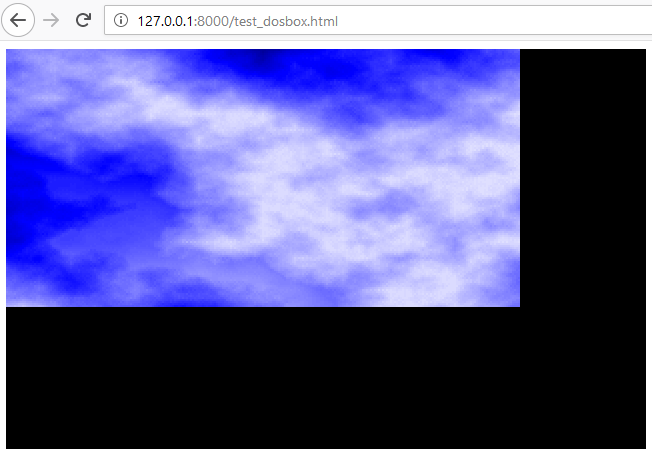

# Programmes écrits en Pascal

Ce repository regroupe mes anciens programmes écrits dans le langage Pascal, à une époque indéterminée et assez lointaine (j'étais au lycée, puis à l'UTBM).

## Recompilation des exécutables simples

Il est possible de recompiler, avec l'éditeur Free Pascal, les codes sources qui ne font pas trop appel à des fonctions bas niveau des machines de l'époque.

Voir : [procedure_recompilation.md](procedure_recompilation.md).

## Test de la librairie SDL

Pour réussir à refaire marcher tous ces programmes, il a été envisagé de recoder les librairies spécifiques (en particulier McgaGraf), en utilisant la SDL. La SDL (Simple DirectMedia Layer) est une librairie dédiée aux jeux vidéos, permettant de piloter l'écran, de récupérer les événements claviers et souris, etc.

Quelques tests rapides ont été réalisés dans le cadre de cette première approche. Voir : [libs/test_sdl.md](libs/test_sdl.md).

Mais cette approche aurait nécessité une certaine quantité de temps, que je n'ai pas. Il existe une solution plus simple, qui permettrait de profiter directement de mes anciennes créations, sans rien avoir à installer.

## Test de js-dos

Js-dos est une librairie JavaScript, basé sur DosBox, permettant d'exécuter des programmes du système d'exploitation "DOS", dans un navigateur internet.

J'y ai pas cru au début, mais il semblerait que ça marche. Même avec des "vrais" jeux.

Voir : [https://github.com/caiiiycuk/js-dos](https://github.com/caiiiycuk/js-dos).

Un premier test a été réalisé. Voir répertoire `test_dosbox_js` de ce repository.

L'ensemble de mes programmes Pascal sera prochainement mis à disposition sur un site, et vous pourrez profiter de mes jeux et mes animations. Youpi.

En attendant, vous pouvez reproduire le test sur votre ordinateur, même si ce n'est pas trivial :

 - Téléchargez ce repository.
 - Installez le langage python v3.x [https://www.python.org/](https://www.python.org/).
 - Dans une fenêtre de commande MS-DOS, allez dans le répertoire de test de js-dos : `cd test_dosbox_js`.
 - Lancez [la commande python](https://stackoverflow.com/questions/7943751/what-is-the-python-3-equivalent-of-python-m-simplehttpserver) permettant de créer un serveur de fichier statique en local : `python -m http.server`
 - Si vous êtes sous Windows, il est possible qu'un message s'affiche demandant sur quelle type de réseau vous êtes. Vous pouvez sélectionner n'importe quoi, ce n'est pas significatif.
 - Avec votre navigateur internet, ouvrez le fichier html de test à partir du serveur, en allant sur l'url locale : `http://127.0.0.1:8000/test_dosbox.html`

Patientez quelques secondes, vous devriez voir une splendide animation affichant un effet de plasma avec transition entre deux images :

C'est tout pour l'instant. Le code source de cette animation, ainsi que tout le reste, arrive très bientôt.

Si vous essayez en ouvrant directement le fichier test\_dosbox.html dans votre navigateur, ça ne fonctionnera pas à cause d'une sécurité concernant les requêtes CORS.

TODO :
Expliquer que le fichier EGAVGA.BGI qui a été placé dans artifice.zip a été récupéré à l'arrache depuis ce jeu : [https://www.oldgames.sk/en/game/pisqorx/downloads/](https://www.oldgames.sk/en/game/pisqorx/downloads/). (J'ai pas réussi à le retrouver à un endroit plus simple).

